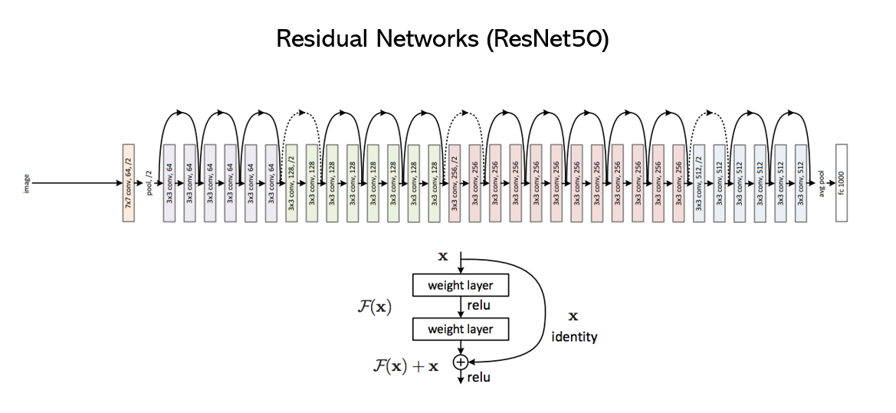
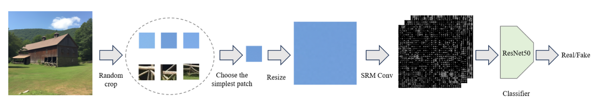
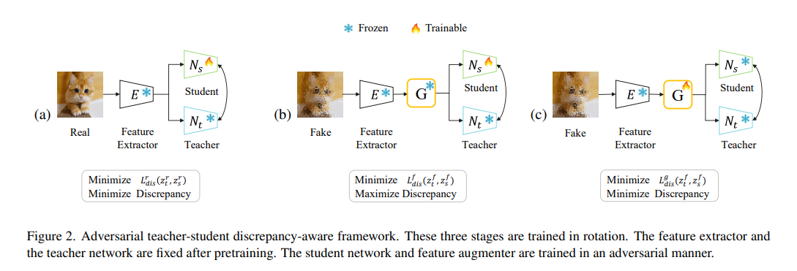
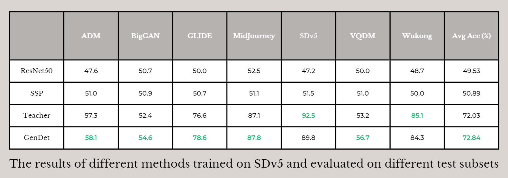
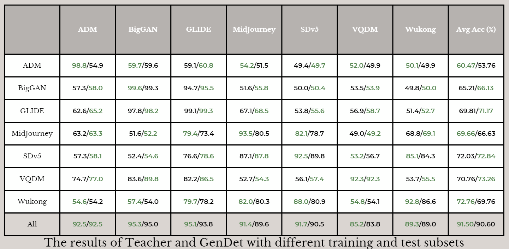

# AI-generated image detection

## Methods

ResNet50 [[arxiv]](https://arxiv.org/abs/1512.03385)

Single Simple Patch (SSP) [[arxiv]](https://arxiv.org/abs/2402.01123)

GenDet Framework using Transformer Encoder [[arxiv]](https://arxiv.org/abs/2312.08880v1)

## Data

Tini GenImage [Kaggle](https://www.kaggle.com/datasets/yangsangtai/tiny-genimage)

7 generators: ADM, BigGAN, GLIDE, MidJourney, Stable Diffusion v1.5, VQDM, Wukong

each with 5000 images, 2500 AI, 2500 Nature, 2000 for train, 500 for test

## Training

ResNet50:
- Optimizer: AdamW (lr=1e-5)
- Loss: Cross Entropy
- Num epoch: 20
- Batch size: 16

SSP:
- Optimizer: Adam (lr=1e-5)
- Loss: Cross Entropy
- Num epoch: 10
- Batch size: 16

GenDet:
- Optimizer: AdamW (lr=1e-5)
- Loss: Cross Entropy, MSE, Custom
- Num epoch: 20
- Batch size: 16

## Result

